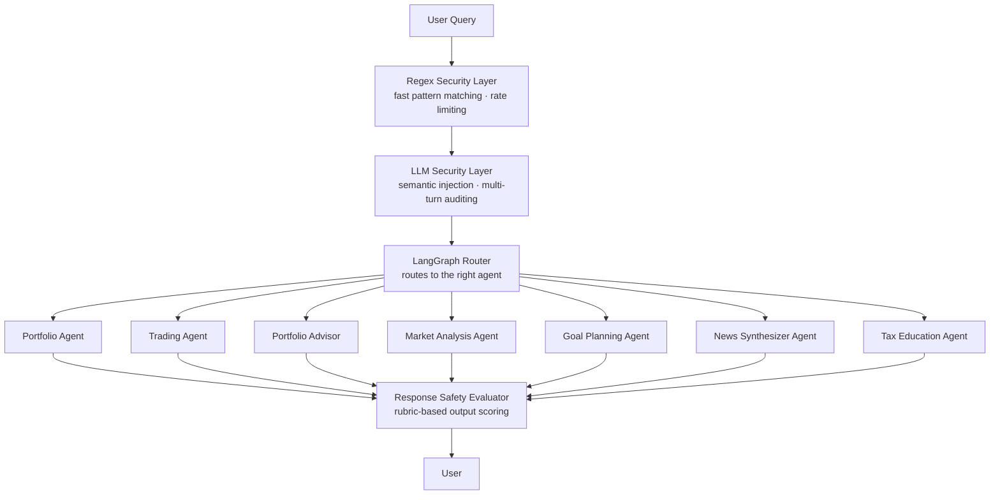
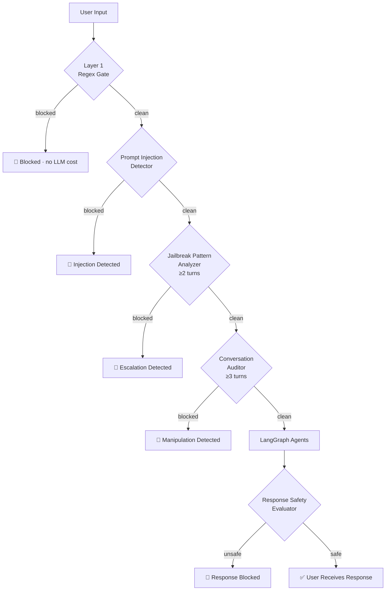

> Democratizing Financial Literacy Through Intelligent Conversational AI

---

## 🎯 Project Overview

The AI Finance Assistant is a production-ready multi-agent AI system designed to democratize financial literacy for beginner investors. It combines real-time market data, a curated financial knowledge base, and intelligent conversational AI to provide personalized guidance on investing, portfolio management, tax education, and financial goal planning — all while maintaining strict educational guardrails to ensure responsible use.

---

## 🏗️ Architecture



---

## 🤖 The 7 Specialized Agents

| Agent | Purpose | Tech |
|-------|---------|------|
| **Portfolio Agent** | Loads and analyzes user portfolio with live prices | yFinance + GPT |
| **Trading Agent** | Simulates buying and selling stocks | yFinance + CSV |
| **Portfolio Advisor** | Educational portfolio recommendations | GPT + RAG |
| **Market Analysis Agent** | Real-time stock data and beginner-friendly insights | yFinance + GPT |
| **Goal Planning Agent** | Financial goal calculator with risk profiles | Math + GPT |
| **News Synthesizer Agent** | Live news headlines with AI synthesis | yFinance + RAG + GPT |
| **Tax Education Agent** | RAG-powered tax education with guardrails | Pinecone + GPT |

---

## 🔧 Tech Stack

| Component | Technology |
|-----------|-----------|
| Language Model | OpenAI GPT-4o-mini |
| Agent Orchestration | LangGraph + LangChain |
| Vector Database | Pinecone |
| Market Data | yFinance |
| Web Interface | Streamlit |
| LLM Security | Two-layer custom security pipeline |
| MCP Server | Model Context Protocol |
| Testing | pytest |

---

## 📁 Project Structure

```
ai-finance-assistant/
├── src/
│   ├── agents/
│   │   ├── portfolio_agent.py
│   │   ├── trading_agent.py
│   │   ├── portfolio_advisor_agent.py
│   │   ├── market_analysis_agent.py
│   │   ├── goal_planning_agent.py
│   │   ├── news_synthesizer_agent.py
│   │   └── tax_education_agent.py
│   ├── core/
│   │   ├── openai_client.py
│   │   ├── logger.py
│   │   ├── security.py
│   │   └── llm_security_layer.py
│   ├── data/
│   │   ├── demo_portfolio.csv
│   │   ├── demo_portfolio_backup.csv
│   │   └── finance_knowledge.py
│   ├── mcp_server/
│   │   └── finance_mcp_server.py
│   ├── rag/
│   │   ├── embedding.py
│   │   ├── index_data.py
│   │   ├── pinecone_client.py
│   │   └── retriever.py
│   ├── utils/
│   │   └── market_data.py
│   ├── web_app/
│   │   └── app.py
│   └── workflow/
│       └── finance_workflow.py
├── tests/
│   ├── test_agents.py
│   ├── test_security.py
│   └── test_workflow.py
├── .env.example
├── config.yaml
├── requirements.txt
└── README.md
```

---

## 🔐 LLM Security Layer

The system features a **two-layer security pipeline** that protects against both known and novel attacks:

### Layer 1 — Regex Security (Fast Gate)
- **Prompt Injection** — detects and blocks attempts to override system instructions
- **Harmful Content** — blocks requests for illegal financial advice (market manipulation, insider trading)
- **Off-topic Queries** — redirects non-finance questions with helpful guidance
- **Output Validation** — ensures responses don't contain direct investment advice or guaranteed returns
- **Rate Limiting** — prevents abuse with configurable request limits per user

### Layer 2 — LLM Security (Deep Semantic Analysis)

Four specialized security agents built on LLM reasoning:

- **Prompt Injection Detector** — Two-stage detection: regex pre-filter + LLM semantic analysis for novel, obfuscated, or indirect injection attempts
- **Jailbreak Pattern Analyzer** — Detects multi-turn escalation: analyzes conversation history for gradual topic shift toward harmful goals across turns
- **Response Safety Evaluator** — LLM-as-judge that scores every response on Safety, Accuracy, Compliance, and Relevance before delivery to the user
- **Multi-turn Conversation Auditor** — Full session audit for semantic drift, context poisoning, cumulative boundary erosion, and identity manipulation

### Security Flow



### Live Security Dashboard

The Streamlit sidebar shows a real-time session security monitor:

- Query count and blocked count per session
- Per-interaction risk score and status (clean / monitoring / elevated / critical)
- Agent routing visibility
- Session reset to clear conversation context

### OWASP LLM Top 10 Coverage

| # | Risk | Status |
|---|------|--------|
| LLM01 | Prompt Injection | ✅ Strong — two-stage detector (regex + LLM) |
| LLM02 | Sensitive Information Disclosure | ✅ Partial — output validator catches system prompt leaks |
| LLM03 | Supply Chain | ⚠️ Partial — uses vetted APIs, no dependency integrity checks |
| LLM04 | Data and Model Poisoning | ❌ Not covered |
| LLM05 | Improper Output Handling | ✅ Strong — output validator + response safety evaluator |
| LLM06 | Excessive Agency | ✅ Strong — agents scoped to specific tasks, trading is simulated only |
| LLM07 | System Prompt Leakage | ⚠️ Partial — leak patterns detected in output |
| LLM08 | Model Misbehavior | ✅ Strong — rubric-based response scoring before delivery |
| LLM09 | Misinformation | ❌ Not covered — disclaimer only |
| LLM10 | Unbounded Consumption | ✅ Strong — rate limiter with configurable per-user limits |

---

## 🧠 RAG Knowledge Base

- **55 financial education documents** across 6 categories:
  - 📚 Basics — investing fundamentals, ETFs, dividends, compound interest
  - 💼 Portfolio — diversification, asset allocation, rebalancing, risk
  - 🎯 Planning — retirement, goal setting, debt payoff, savings
  - 💰 Tax — IRA, 401k, capital gains, tax-loss harvesting
  - 📈 Market — P/E ratio, volatility, Fed, sectors, technical analysis
  - 📰 News — earnings season, economic indicators, geopolitical risk
- Indexed in Pinecone vector database
- Semantic search retrieves most relevant docs for each query

---

## 🖥️ Streamlit UI — 5 Tabs

| Tab | Features |
|-----|---------|
| 💬 Finance Chat | Conversational AI with automatic agent routing and inline security indicators |
| 📊 Portfolio | Manual editor, live analysis, pie chart, gain/loss chart, trading panel |
| 📈 Market Analysis | Company name resolution, live prices, 52W gauge chart |
| 🎯 Goal Planner | Interactive calculator, projection chart, risk profiles |
| 📰 News | Live headlines, expandable cards, AI synthesis |

---

## 🔌 MCP Server — Claude Desktop Integration

Exposes 5 finance tools to Claude Desktop via Model Context Protocol:

| Tool | Description |
|------|-------------|
| `get_stock_info` | Real-time stock price and analysis |
| `analyze_portfolio` | Portfolio summary with live prices |
| `calculate_goal` | Financial goal projection calculator |
| `get_stock_news` | Latest news headlines with AI synthesis |
| `answer_finance_question` | General finance Q&A via RAG |

---

## 🚀 Setup Instructions

### Prerequisites
- Python 3.10+
- OpenAI API key
- Pinecone API key

### Installation

```bash
# Clone the repository
git clone https://github.com/ChitrashreeShankaranandha/ai-finance-assistant.git
cd ai-finance-assistant

# Create virtual environment
python -m venv venv
venv\Scripts\activate  # Windows
source venv/bin/activate  # Mac/Linux

# Install dependencies
pip install -r requirements.txt

# Set up environment variables
cp .env.example .env
# Then edit .env and add your API keys
```

### Running the App

```bash
streamlit run src/web_app/app.py
```

### Running Tests

```bash
pytest tests/ -v
```

### MCP Server Setup (Claude Desktop)

Add to `claude_desktop_config.json`:

```json
{
  "mcpServers": {
    "ai-finance-assistant": {
      "command": "/path/to/venv/Scripts/python.exe",
      "args": ["/path/to/src/mcp_server/finance_mcp_server.py"],
      "cwd": "/path/to/ai-finance-assistant"
    }
  }
}
```

---

## 🧪 Testing

42 tests across 3 test files:
```
├── test_agents.py    → 12 tests (market, goal, tax, news agents)
├── test_security.py  → 24 tests (injection, harmful content, rate limiting)
└── test_workflow.py  →  6 tests (LangGraph routing)
```

---

## ⚠️ Disclaimer

This system is for **educational purposes only** and does not constitute financial advice. Always consult a qualified financial advisor before making investment decisions.

---

## 🌐 Live Demo

**Deployed on Hugging Face Spaces:**  
👉 https://huggingface.co/spaces/ChitrashreeShankaranandha/ai-finance-assistant

---

## 🔮 Future Directions

- **Conversation Memory** — persistent user preferences and session history across logins
- **Security Threshold Tuning** — labeled test dataset for precision/recall optimization of multi-turn auditor
- **User Authentication** — private portfolios per user with Streamlit Authenticator
- **Cloud Database** — PostgreSQL/Supabase for persistent multi-user portfolios
- **Voice Interface** — natural speech interaction
- **Mobile App** — native iOS/Android apps
- **Advanced Analytics** — Monte Carlo simulations, risk modeling
- **International Markets** — support for global exchanges
- **Cryptocurrency** — digital asset education and analysis

---

## 👩‍💻 Author

**Chitrashree Shankaranandha**  
Built with passion for making financial literacy accessible to everyone.  
[GitHub](https://github.com/ChitrashreeShankaranandha) · [LinkedIn](https://www.linkedin.com/in/chitrashreeshankaranandha/)